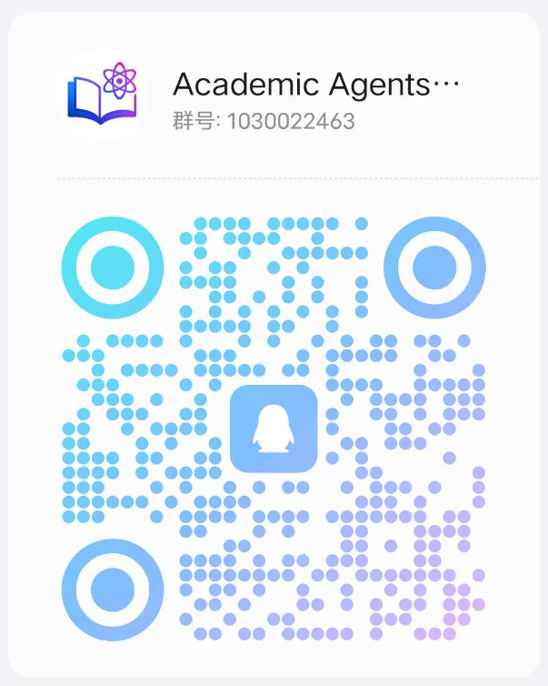

<p align="right">
   <strong>Chinese</strong> | <a href="./docs/README.en.md">English</a>
</p>

<div align="center">


# Academic Agents Studio

### 🤖 Next-Generation Academic AI Agent Application Service Platform

<p>
<strong>AI Agent-driven Intelligent Platform for the Entire Academic Research Workflow</strong><br>
Supports academic scenarios including paper writing, literature analysis, code interpretation, multilingual translation, and more.
</p>

[![Github][Github-image]][Github-url]
[![License][License-image]][License-url]
[![Python][Python-image]][Python-url]
[![Gradio][Gradio-image]][Gradio-url]
[![Stars][Stars-image]][Stars-url]

[Github-image]: https://img.shields.io/badge/GitHub-Repository-black?style=flat-square&logo=github
[License-image]: https://img.shields.io/badge/License-MIT-orange?style=flat-square
[Python-image]: https://img.shields.io/badge/Python-3.9+-blue?style=flat-square&logo=python
[Gradio-image]: https://img.shields.io/badge/Gradio-Web%20UI-yellow?style=flat-square
[Stars-image]: https://img.shields.io/github/stars/AcademicAgentsStudio?style=flat-square

[Github-url]: https://github.com/AcademicAgentsStudio
[License-url]: https://github.com/AcademicAgentsStudio/blob/master/LICENSE
[Python-url]: https://www.python.org/
[Gradio-url]: https://gradio.app/
[Stars-url]: https://github.com/AcademicAgentsStudio/stargazers

# Free Academic Agents MCP Services


</div>

## 🎓 Project Introduction

**Free Academic Agents MCP Services** is an intelligent agent service platform specifically designed for academic research and scientific researchers. We are committed to providing high-quality, professional academic support services for global researchers and scholars, significantly enhancing academic research efficiency and paper writing quality through advanced artificial intelligence technology.

### 🌟 Core Philosophy

- **🆓 Free Service**: Fully committed to making academic agent services free and open to academic users
- **🔬 Academic Specialization**: AI services specifically optimized for academic scenarios
- **🌍 Global Service**: Supports multiple languages, serving researchers worldwide
- **⚡ Efficient & Convenient**: Based on MCP protocol, seamlessly integrates into your academic workflow

---

## 📊 Service Overview

Currently providing core academic agent services covering main requirements of academic research:

### 1️⃣ Academic Writing Service (FreeAcademicWrite)

**Professional Academic Text Processing and Optimization Platform**

🔧 **Core Functions**:
- **Academic Corpus Polishing** - Grammar optimization, sentence structure improvement, and readability enhancement for Chinese academic texts
- **Grammar Error Checking** - Precise grammar and spell checking for English academic texts
- **Intelligent Translation** - Automatic language recognition, accurate translation of academic content in various languages
- **Academic English-Chinese Translation** - High-quality bidirectional translation service for academic scenarios

🎯 **Application Scenarios**:
- Paper writing and revision
- Academic report optimization
- Research proposal polishing
- International journal submission preparation

### 2️⃣ Web Search Service (FreeWebSearch)

**Intelligent Academic Information Retrieval and Analysis System**

🔧 **Core Functions**:
- **Multi-model Retrieval** - Integrates multiple search judgment models for precise query intent understanding
- **Semantic Understanding** - Deep understanding of academic query context, providing more relevant results
- **Real-time Information** - Access to latest research trends, policy changes, and academic information
- **Full-stack Retrieval** - Integrates multiple information sources including academic databases, news resources, official documents

🎯 **Application Scenarios**:
- Literature survey and review
- Tracking latest research trends
- Policy and regulation queries
- Background information collection

### 3️⃣ Chart Visualization Service (FreeAcademicChart)

**Professional Academic Data Visualization Solution**

🔧 **Core Functions**:
- **Multiple Chart Types** - Supports 10+ chart types including bar charts, line charts, pie charts, donut charts, radar charts
- **High Customization** - Customizable labels, data, colors, and style configurations
- **Academic Standards** - Chart quality compliant with academic publishing standards
- **Instant Generation** - Quickly generates high-quality chart URLs supporting direct referencing

🎯 **Application Scenarios**:
- Research data visualization
- Paper chart creation
- Academic report illustrations
- Data analysis display

### 4️⃣ Result Format Conversion Service (FreeAcademicFormatter)

**Intelligent Tool Result Format Conversion and Optimization**

🔧 **Core Functions**:
- **HTML Formatting** - Intelligently converts raw results from external tools into concise HTML format
- **Markdown Conversion** - Provides basic conversion from text to Markdown format
- **Custom Configuration** - Supports formatting processing using default large models
- **Multi-scenario Adaptation** - Optimizes visualization effects of tool return content on front-end pages

🎯 **Application Scenarios**:
- Front-end display of tool return results
- Content formatting for academic reports
- Pre-processing for data visualization
- Multi-format document conversion

---

## 🚀 Quick Start

### Environment Requirements

- Python 3.8+
- MCP (Model Context Protocol) Client

### Service Configuration

All services are managed through the `Academic_Free_MCP_Servers.json` configuration file:

```json
{
    "FreeAcademicWrite": {
      "name": "Academic Agents Free Academic Writing Service",
      "url": "https://academicwrite.freemcps.aiearth.vip/sse",
      "headers": {
        "Authorization": "Bearer aioagi.tech"
      },
      "description": "Academic Agents is an intelligent assistant platform specifically designed for academic research and paper writing, providing comprehensive academic writing support for researchers and scholars. It integrates four core functions: Academic corpus polishing supports grammar optimization, sentence structure improvement, and readability enhancement for Chinese academic texts; Grammar error checking provides precise grammar and spell checking for English academic texts; Intelligent translation has automatic language recognition capability, accurately translating academic content in various languages; Academic English-Chinese translation specifically targets academic scenarios, using natural language processing technology and rhetoric knowledge to perform high-quality bidirectional translation between English and Chinese.",
      "enabled": true
    },
    "FreeWebSearch": {
      "name": "Academic Agents Free Web Search Service",
      "url": "https://websearch.freemcps.aiearth.vip/sse",
      "headers": {
        "Authorization": "Bearer aioagi.tech"
      },
      "description": "Integrates multiple retrieval models including search judgment and semantic understanding, connecting professional search engineering frameworks and various real-time information retrieval tools, providing real-time full-stack internet information retrieval, improving LLM answer accuracy and timeliness.",
      "enabled": true
    },
    "FreeAcademicChart": {
      "name": "Academic Agents Free Academic Chart Visualization Service",
      "url": "https://academicchart.freemcps.aiearth.vip/sse",
      "headers": {
        "Authorization": "Bearer aioagi.tech"
      },
      "description": "Supports generating multiple types of charts and returning chart URLs, including: bar charts, line charts, pie charts, donut charts, radar charts, polar area charts, scatter plots, bubble charts, radial gauge charts, speedometer charts; customizable chart configurations including: labels, data, and colors.",
      "enabled": true
    },
    "FreeAcademicFormatter": {
      "name": "Academic Agents Free Result Format Conversion Service",
      "url": "https://academicchart.freemcps.aiearth.vip/sse",
      "headers": {
        "Authorization": "Bearer aioagi.tech"
      },
      "description": "Supports intelligent conversion of raw results from external tools into concise HTML format. Uses default large models for formatting processing, while also providing basic conversion from text to Markdown format. Mainly used to optimize the visualization effect of return content on front-end pages.",
      "enabled": true
    }
}
```

---

## 🔧 Technical Features

### Advanced Architecture
- **MCP Protocol**: Adopts the latest Model Context Protocol to ensure efficient communication
- **SSE Transmission**: Real-time data transmission based on Server-Sent Events
- **Modular Design**: Each service is independently deployed without interference

### Performance Optimization
- **Intelligent Caching**: Reduces duplicate requests, improves response speed
- **Load Balancing**: Supports high concurrency access
- **Fault Tolerance**: Ensures service stability

### Security Assurance
- **Authentication & Authorization**: Secure API key management
- **Data Privacy**: Strict protection of user academic data
- **Service Monitoring**: Real-time service status monitoring

---

## 🌍 Service Support

### Language Support
- **Chinese**: Complete support for Simplified and Traditional Chinese
- **English**: Professional English academic text processing
- **Multilingual**: Translation services for major international languages

### Discipline Coverage
- Computer Science and Technology
- Biomedical and Life Sciences
- Physics and Materials Science
- Chemistry and Chemical Engineering
- Mathematics and Statistics
- Economics and Management Science
- Humanities and Social Sciences

---

## 🚀 Development Plan

### Service Expansion Plan

We are actively developing more professional academic agent MCP services to meet researchers' needs in different scenarios:

#### 🔬 Upcoming Services

**📚 Academic Literature Management Service (FreeAcademicLibrary)**
- Intelligent literature retrieval and recommendation
- Automatic citation format generation
- Literature notes and annotation management
- Academic knowledge graph construction

**📊 Data Analysis Service (FreeAcademicAnalysis)**
- Statistical analysis tool integration
- Machine learning model training
- Experimental data processing
- Result visualization and interpretation

**🤖 Academic AI Assistant Service (FreeAcademicAssistant)**
- Personalized research suggestions
- Academic schedule management
- Peer review assistance
- Research project planning

**🌐 Academic Collaboration Service (FreeAcademicCollaboration)**
- Cross-institutional research collaboration
- Academic resource sharing
- Online academic conference support
- Intellectual property protection

#### 🎯 Long-term Vision

Our goal is to build a complete **Academic Agents Ecosystem** covering the entire lifecycle of academic research:

1. **Pre-research Phase**: Literature survey, topic analysis, proposal design
2. **Research Process**: Data collection, experiment execution, result analysis
3. **Result Output**: Paper writing, chart creation, academic publication
4. **Knowledge Dissemination**: Academic exchange, peer review, knowledge sharing

## 🌟 Join Our Community

Welcome to the **Academic Agents Studio** academic agent community! Here you can:

- 💬 **Exchange usage experiences**: Share usage tips, get best practices
- 🐛 **Report issues**: Report bugs, suggest improvements
- 🎯 **Feature discussions**: Participate in new feature design, propose requirement suggestions
- 📚 **Academic exchange**: Exchange research insights with other scholars
- 🚀 **Early access**: Experience new features and version updates first

### 📱 Scan QR Code to Join Group Chat

<div align="center">
<table>
<tr>
<td align="center">
<br>
<strong>🐧 QQ Discussion Group</strong><br>
<em>Academic Agents Discussion Group</em>
</td>
<td align="center">
<br>
<strong>💬 WeChat Discussion Group</strong><br>
<em>Academic Agents Discussion Group</em>
</td>
</tr>
</table>

</div>

> [!TIP]
> **Group Benefits**:
> - 🎁 New user exclusive configuration guide
> - 📖 Exclusive usage tutorials and templates
> - 🔥 Early testing of latest features
> - 💡 One-on-one technical support
> - 📊 Academic resource sharing

## 📞 Contact & Support

### Technical Support
- **Website**: [https://aioagi.tech](https://aioagi.tech)
- **Email**: aioagi@aioagi.tech
- **Community**: Join our academic exchange groups

### Feedback & Suggestions
We highly value user feedback and suggestions. If you encounter any issues during use, or have suggestions for feature improvements, please contact us through:

- GitHub Issues
- Email feedback: aioagi@aioagi.tech
- Online customer service: Visit official website for real-time support

---

## 📄 License Agreement

This project adopts an open-source license agreement and is provided free of charge to academic users. Please note:

- ✅ Completely free for academic research use
- ✅ Educational institutions can use freely
- ✅ No restrictions for personal learning and research
- ❌ Prohibited for commercial purposes
- ❌ Prohibited for malicious use or service abuse

---

## 🙏 Acknowledgments

Thanks to all researchers and developers who have contributed to academic research and open science. The mission of **Free Academic Agents** is to promote the progress of academic research through technological innovation, providing better tools and services for the global academic community.

---

**🌟 Empowering Academic Research with AI, Making Knowledge Creation More Efficient!**

*© 2025 Academic Agents Studio Team. All rights reserved.*
```
